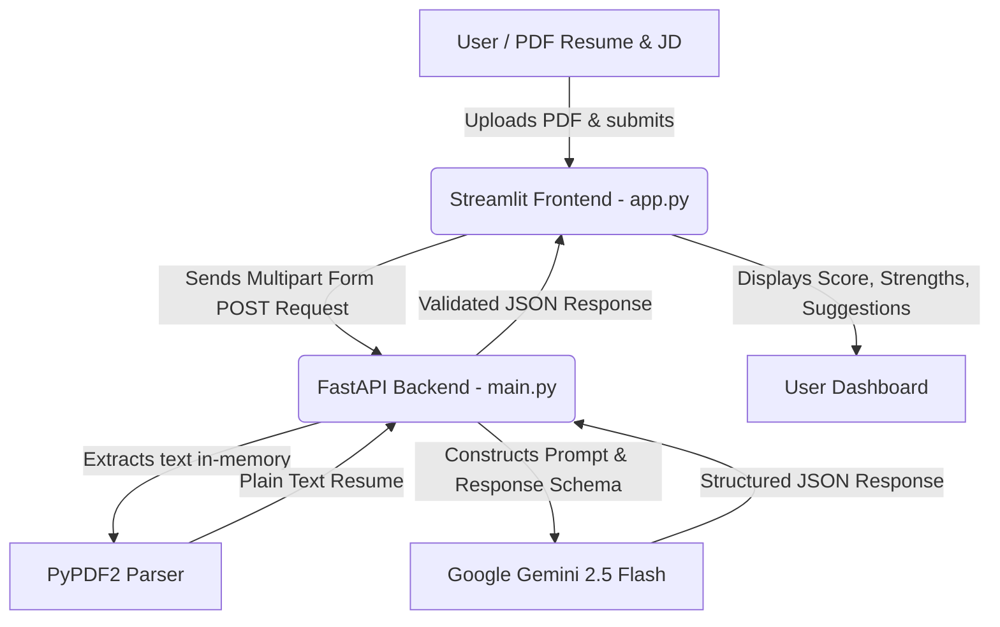

# 📄 ResumeAnalyzer - AI-Powered Resume Screener & ATS Optimizer

[](https://www.python.org/)
[](https://fastapi.tiangolo.com/)
[](https://streamlit.io/)
[](https://ai.google.dev/)

**Agentic AI** project designed to screen and optimize resumes using an AI-powered pipeline. This application parses PDF resumes, analyzes them against a target job description using the **Google Gemini 2.5 Flash** model, and presents the insights on an interactive dashboard.

LIVE LINK : https://resumeanalyzer-frontend-0ern.onrender.com
---

## 🌟 Key Features

*   **📈 ATS Score Gauge**: Visual indicator showing how well the resume matches standard recruitment system requirements (0-100 scale).
*   **🔍 Keyword & Skill Gap Analysis**: Automatically identifies critical technical or soft skills missing from the resume when matched against a target Job Description.
*   **✅ Strengths & Weaknesses Breakdown**: Generates clear, structured points identifying the strongest aspects of the resume and areas needing attention.
*   **💡 Actionable Improvement Suggestions**: Step-by-step suggestions to help the resume stand out.
*   **✨ AI Bullet Point Rewriter**: An interactive tool to rewrite weak resume bullet points into high-impact, results-oriented metrics (using the Google XYZ formula).

---

## 🛠️ Tech Stack

*   **Frontend**: `Streamlit` (Interactive Python Web Application Framework)
*   **Backend**: `FastAPI` (High-performance API server with automatic documentation)
*   **PDF Extraction**: `PyPDF2` (Parses PDF text streams in-memory)
*   **LLM/AI Model**: `Google Gemini 2.5 Flash Lite` (via the latest `google-genai` SDK)
*   **Environment Management**: `python-dotenv`

---

## 📐 Project Architecture



---

## 📂 Project Directory Structure

```text
ResumeAnalyzer/
├── backend/
│   └── main.py          # FastAPI server handling API routes and Gemini LLM logic
├── frontend/
│   └── app.py           # Streamlit UI dashboard code
├── .env                 # API Keys & Local System Configurations (gitignore this in production)
├── requirements.txt      # Python dependencies for the entire project
└── README.md            # Detailed project documentation (this file)
```

---

## ⚙️ Installation & Local Setup

Follow these simple steps to run this project locally:

### 1. Clone the repository
```bash
git clone https://github.com/Gargi3012/ResumeAnalyzer.git
cd ResumeAnalyzer
```

### 2. Install Python Packages
Install all required libraries for both the backend and frontend using the single root-level `requirements.txt`:
```bash
pip install -r requirements.txt
```

### 3. Set Up Environment Variables
Create a `.env` file in the root directory:
```env
GEMINI_API_KEY=your_actual_gemini_api_key
BACKEND_URL=http://localhost:8000
```
> ⚠️ **Note**: A default Gemini key has been configured inside the backend, but it's highly recommended to replace it with your own key.

---

## 🚦 How to Run the Application

You need to run the **Backend** and **Frontend** servers concurrently in separate terminal windows.

### Step 1: Start the Backend (FastAPI)
Run the following command from the root directory:
```bash
uvicorn backend.main:app --reload
```
*   **URL**: `http://localhost:8000`
*   **Interactive Documentation (Swagger UI)**: `http://localhost:8000/docs`

### Step 2: Start the Frontend (Streamlit)
Open a new terminal window, navigate to the root directory, and run:
```bash
streamlit run frontend/app.py
```
*   **URL**: `http://localhost:8501` (Opens automatically in your browser)

---


